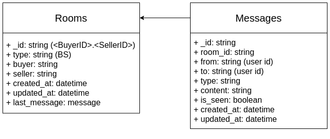

# CZ Messenger

## Techstack
- Nodejs: Runtime Environment
- Express: Web framework
- Socket.io: Socket library
- Redis (for scalability): pub/sub messages and socket ids
- MongoDB: Message store


## API
### Rest API
- Postman docs: https://documenter.getpostman.com/view/4640091/TVRd8qr4

### Socket
1. Handshake:
     - Namespace: /messenger
     - Query:
          - ```token```
          - ```user_id```
          - ```user_role```: BUYER / SELLER

     - Example:
     ```
     var socket = io('http://localhost:3000/messenger', {
     query: {
          token: 'access_token',
          user_id: 'user_id',
          user_role: 'BUYER'
     }});
     ```

2. Events:
     - ```reconnect```:
          - client: emit event ```verify_user```:
               - ```token```
               - ```user_id```
               - ```user_role```: BUYER / SELLER

     - ```verify_user```:
          - client:
               - ```token```
               - ```user_id```
               - ```user_role```: BUYER / SELLER
          - server:
               - ```status```: boolean

     - ```create_room```:
          - client:
               - ```type```: Room type. Value: BS
               - ```buyer```: Buyer ID
               - ```seller```: Seller ID
               - ```shop_id```: Shop ID
               -  ```creator```: Buyer ID or Seller ID

          - server:
               - ```room_id```: Room ID. Value: \<BuyerID\>.\<SellerID\>
               - ```type```: Room type. Value: BS
               - ```buyer```: Buyer ID
               - ```seller```: Seller ID
               - ```shop_id```: Shop ID
               -  ```creator```: Buyer ID or Seller ID

     - ```new_message```:
          - client:
               - ```room_id```: Room ID. Value: \<BuyerID\>.\<SellerID\>
               - ```from```: Sender ID
               - ```to```: Receiver ID
               - ```type```: TEXT | IMAGE | EMOJI
               -  ```content```: Message content
               -  ```client_message_id```: (optional) Client generator unique id for server to comfirm

          - server:
               - ```_id```: Message Id generated by server.
               - ```room_id```: Room ID. Value: \<BuyerID\>.\<SellerID\>
               - ```from```: Sender ID
               - ```to```: Receiver ID
               - ```type```: TEXT | IMAGE | EMOJI
               -  ```content```: Message content
               -  ```client_message_id```: (optional) Client generator unique id for server to comfirm

     - ```typing```:
          - client:
               - ```room_id```: Room ID. Value: \<BuyerID\>.\<SellerID\>
               - ```from```: Sender ID
               - ```to```: Receiver ID
          - server:
               - ```room_id```: Room ID. Value: \<BuyerID\>.\<SellerID\>
               - ```from```: Sender ID
               - ```to```: Receiver ID
          

     - ```stop_typing```:
          - client:
               - ```room_id```: Room ID. Value: \<BuyerID\>.\<SellerID\>
               - ```from```: Sender ID
               - ```to```: Receiver ID
          - server:
               - ```room_id```: Room ID. Value: \<BuyerID\>.\<SellerID\>
               - ```from```: Sender ID
               - ```to```: Receiver ID
          

     - ```seen_messages```:
          - client:
               - ```room_id```: Room ID. Value: \<BuyerID\>.\<SellerID\>
               - ```from```: Sender ID
               - ```to```: Receiver ID
               - ```message_ids```: An array of the seen messages 

          - server:
               - ```room_id```: Room ID. Value: \<BuyerID\>.\<SellerID\>
               - ```from```: Sender ID
               - ```to```: Receiver ID
               - ```message_ids```: An array of the seen messages 


## DB Schema


